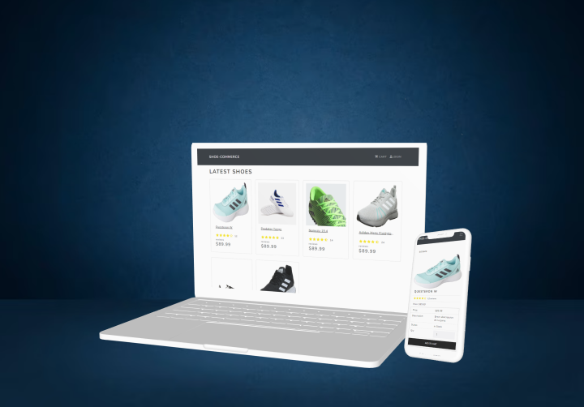

# Shoe Commerce



A full-stack e-commerce platform for selling shoes, featuring a range of functionalities built with React, Node.js, Express, and MongoDB.

## Features

- Full-featured shopping cart
- Product reviews and ratings
- Top products carousel (To be developed)
- Product pagination (To be developed)
- Product search feature (To be developed)
- User profile with order history
- Admin product management (To be developed)
- Admin user management (To be developed)
- Admin Order details page (To be developed)
- Mark orders as delivered option (To be developed)
- Checkout process (shipping, payment method, etc)
- PayPal / credit card integration (To be developed)
- Database seeder (products & users)

## Usage

### Setting Up MongoDB and PayPal

1. Create a MongoDB database and obtain your MongoDB URI from [MongoDB Atlas](https://www.mongodb.com/cloud/atlas).

2. Create a PayPal account and obtain your Client ID from [PayPal Developer](https://developer.paypal.com/).

### Environment Variables

Rename the `.env.example` file to `.env` and add the following:

```
NODE_ENV = development
PORT = 5000
MONGO_URI = your_mongodb_uri
JWT_SECRET = 'xyz123'
```

Change the JWT_SECRET to your desired secret.

## Installation (Frontend & Backend)

# Install dependencies for both frontend and backend

```
npm install
cd frontend
npm install
```

## Running the Application

# Run frontend (:5173) & backend (:5000)

```
npm run dev
```

# Run backend only

```
npm run server
```

# Create frontend production build

```
cd frontend
npm run build
```

## Seeding the Database

You can seed the database with sample users and products or destroy all data using the following commands:

# Import data

```
npm run data:import
```

# Destroy data

```
npm run data:destroy
```

## Sample User Logins

```
Admin:

Email: admin@email.com
Password: 123456
Customer (John):

Email: john@email.com
Password: 123456
Customer (Jane):

Email: jane@email.com
Password: 123456
```
